# Javascript-Forever
<table>

<tr><td>

|   Modules  | Topics                                                    |
|-----------|:------------------------------------------------------------------------------------------------------------- |
| 01    |[Introduction](./readMe.md)                                                             |
| 02    |[Data Types](/Module_02/02_module_Data_types.md)                                                |
| 03    |[Booleans, Operators, Date](./03_module_Booleans_operators_date/03_booleans_operators_date.md)   |
| 04    |[Conditionals](./04_module_Conditionals/04_module_conditionals.md)                                             |
| 05    |[Arrays](./05_module_Arrays/05_module_arrays.md)                                                      |
| 06    |[Loops](./06_module_Loops/06_module_loops.md)                                                       |
| 07    |[Functions](./07_module_Functions/07_module_functions.md)                                                 |
| 08    |[Objects](./08_module_Objects/08_module_objects.md)                                                    |
| 09    |[Higher Order Functions](./09_module_Higher_order_functions/09_module_higher_order_functions.md)       |
| 10    |[Sets and Maps](./10_module_Sets_and_Maps/10_module_Sets_and_Maps.md)                                           |
| 11    |[Destructuring and Spreading](./11_module_Destructuring_and_spreading/11_module_destructuring_and_spreading.md)  |
| 12    |[Regular Expressions](./12_module_Regular_expressions/12_module_regular_expressions.md)    |
| 13    |[Console Object Methods](./13_module_Console_object_methods/13_module_console_object_methods.md)    |
| 14    |[Error Handling](./14_module_Error_handling/14_module_error_handling.md)                                          |
| 15    |[Classes](./15_module_Classes/15_module_classes.md)                                                    |

</td>
<td>

|   Modules  | Topics                                                    |
|-----------|:------------------------------------------------------------------------------------------------------------- |
| 16    |[JSON](./16_module_JSON/16_module_json.md)                                                         |
| 17    |[Web Storages](./17_module_Web_storages/17_module_web_storages.md)                                             |
| 18    |[Promises](./18_module_Promises/18_module_promises.md)                                                   |
| 19    |[Closure](./19_module_Closures/19_module_closures.md)                                                   |
| 20    |[Writing Clean Code](./20_module_Writing_clean_codes/20_module_writing_clean_codes.md)   |
| 21    |[DOM](./21_module_DOM/21_module_dom.md)                                                          |
| 22    |[Manipulating DOM Object](./22_module_Manipulating_DOM_object/22_module_manipulating_DOM_object.md)   |
| 23    |[Event Listeners](./23_module_Event_listeners/23_module_event_listeners.md)                                        |
| 24    |[Mini Project: Solar System](./24_module_Project_solar_system/24_module_project_solar_system.md)   |
| 25    |[Mini Project: World Countries Data Visulalization 1](./25_module_World_countries_data_visualization_1/25_module_world_countries_data_visualization_1.md) |
| 26    |[Mini Project: World Countries Data Visulalization 2](./26_module_World_countries_data_visualization_2/26_module_world_countries_data_visualization_2.md) |
| 27    |[Mini Project: Portfolio](./27_module_Mini_project_portfolio/27_module_mini_project_portfolio.md)   |
| 28    |[Mini Project: Leaderboard](./28_module_Mini_project_leaderboard/28_module_mini_project_leaderboard.md)       |
| 29    |[Mini Project:Animating characters](./29_module_Mini_project_animating_characters/29_module_mini_project_animating_characters.md)   |
| 30    |[Final Projects](./30_module_Mini_project_final/30_module_mini_project_final.md)                                      |

</td>
</tr>
</table>

<div> Learn to 💙️ Javascript </div>
<div align="center">
<h1> Javasript Forever: Module 01 - Introduction </h1>
 <a class="header-badge" target="_blank" href="https://www.linkedin.com/in/taha-gandhi-5525b1160/">
  
  </a>
  <a class="header-badge" target="_blank" href="https://twitter.com/gandhi_taha">
  
  </a>
  </div>
<br>

## Module 1
- [JavaScript Forever](#Javascript-Forever)
  - [Introduction](#introduction)
  - [Requirements](#requirements)
  - [Setup](#setup)
    - [Install Node.js](#install-nodejs)
    - [Browser](#browser)
    - [Installing Google Chrome](#installing-google-chrome)
    - [Opening Google Chrome Console](#opening-google-chrome-console)
    - [Writing Code on Browser Console](#writing-code-on-browser-console)
        - [Console.log](#consolelog)
        - [Console.log with Multiple Arguments](#consolelog-with-multiple-arguments)
        - [Comments](#comments)
        - [Syntax](#syntax)
      - [Arithmetics](#arithmetics)
    - [Code Editor](#code-editor)
      - [Installing Visual Studio Code](#installing-visual-studio-code)
      - [How to Use Visual Studio Code](#how-to-use-visual-studio-code)
  - [Adding JavaScript to a Web Page](#adding-javascript-to-a-web-page)
    - [Inline Script](#inline-script)
    - [Internal Script](#internal-script)
    - [External Script](#external-script)
    - [Multiple External Scripts](#multiple-external-scripts)
  - [Introduction to Data types](#introduction-to-data-types)
    - [Numbers](#numbers)
    - [Strings](#strings)
    - [Booleans](#booleans)
    - [Undefined](#undefined)
    - [Null](#null)
  - [Checking Data Types](#checking-data-types)
  - [Comments Again](#comments-again)
  - [Variables](#variables)
- [Practice](#practice)
## Hello and Welcome Guys

**Cheers** for opting to this course _Javascrip Forever_.  you will learn everything you need to be a JavaScript programmer, and in general, the whole concept of programming with challenges to solve at end.

In this we will go through **_Javascript Moudles_**, as its the most popular programming language known to the mankind.

JavaScript is used **_to add interactivity to websites, to develop mobile apps, desktop applications, games_** and nowadays JavaScript can be used for **_machine learning_** and **_AI_**.
**_JavaScript (JS)_** has increased in popularity in recent years and has been the leading
programming language for six consecutive years.

## Requirements

No prior knowledge of programming is required to follow this course. You need only:

1. Motivation
2. A computer
3. Internet
4. A browser
5. A code editor

## Setup

I believe you have the motivation and a strong desire to be a developer, a computer and Internet. If you have those, then you have everything to get started.

### Install Node.js

We may not need node.js right now but we need it for later. Download From here[Node.js](https://nodejs.org/en/download/).
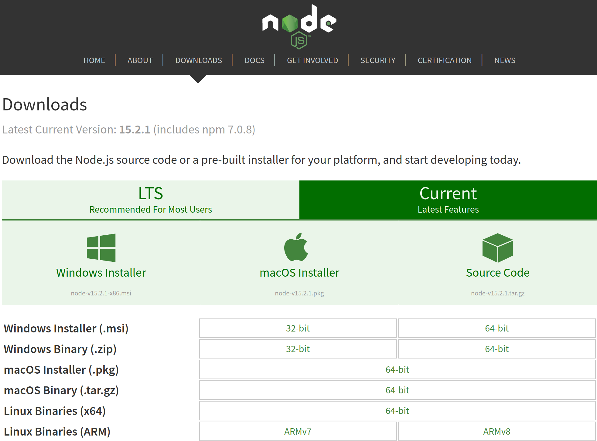

Click appropriate flavour of script to your O.S.
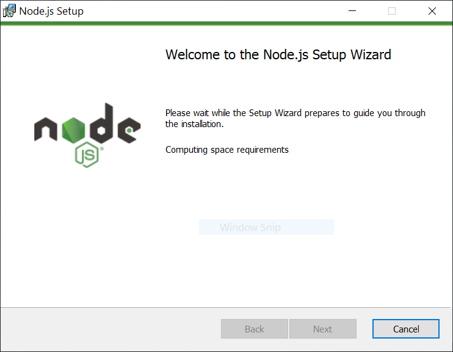

For Linux/Mac os machine follow this commands.
- Debian:
```sh
sudo apt install nodejs
```
- Mac Os:
```sh
sudo brew install nodejs 
```
We can check if node is installed on our local machine by opening our device terminal or command prompt.
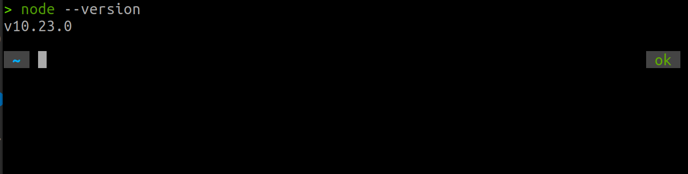
On your prompt you will see node version 12.14.1/17.0 or as per the latest available at that time.

### Browser

There are many browsers out there. However, I strongly recommend Google Chrome.

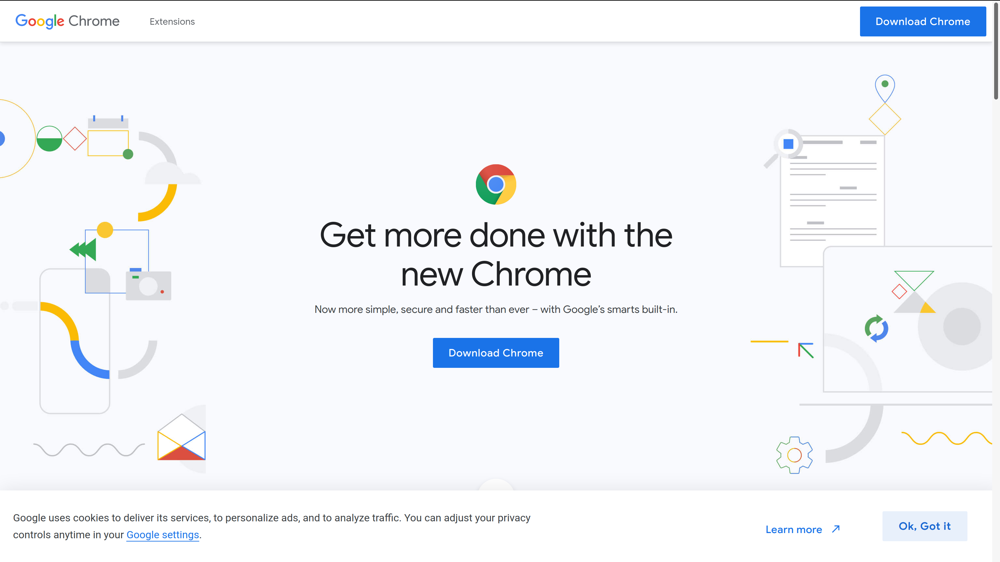
#### Installing Google Chrome

Install [google chrome](https://www.google.com/chrome/) if you do not have one yet. We can write small JavaScript code on the browser console, but we do not use the browser console to develop applications.
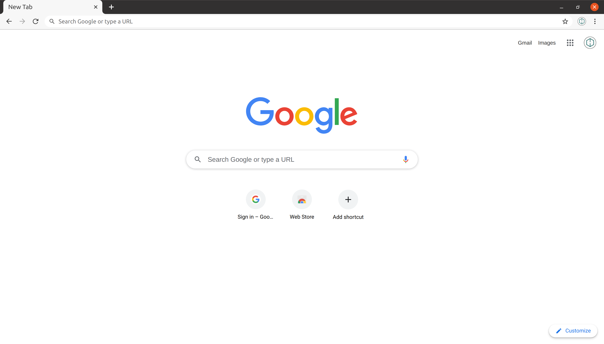
#### Opening Google Chrome Console

You can open Google Chrome console either by clicking three dots at the top right corner of the browser, selecting _More tools -> Developer tools_ or using a keyboard shortcut. I prefer using shortcuts.
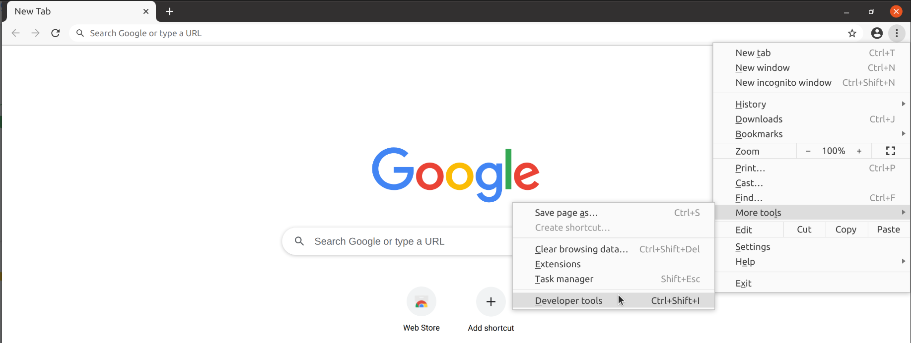
- Mac Os:
```sh
Command+Option+J
```
- Windows/Linux:
```sh
Ctl +Shift+I
```
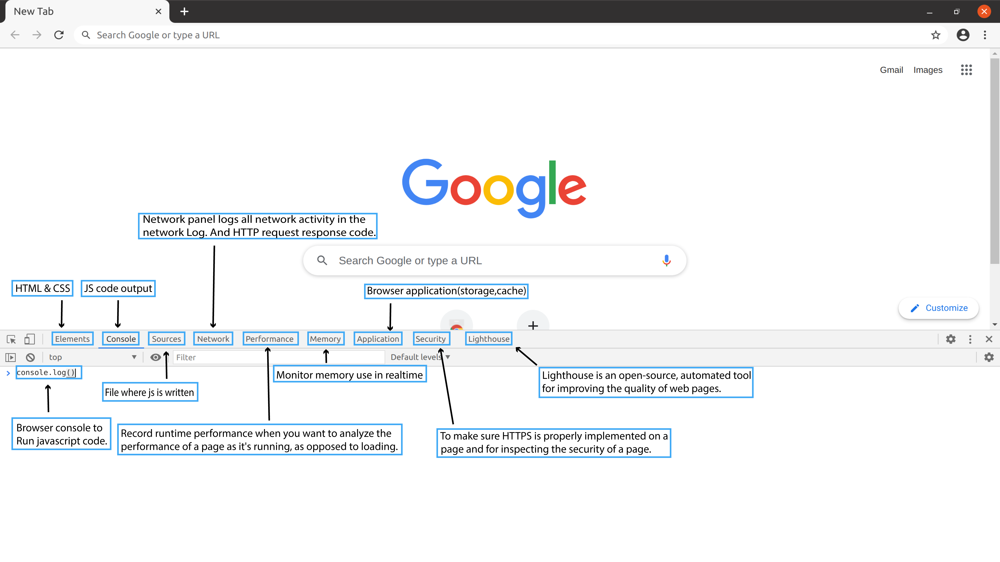

After you open the Google Chrome console, try to explore the marked buttons. We will spend most of the time on the Console. The Console is the place where your JavaScript code goes. The Google Console V8 engine changes your JavaScript code to machine code.
Let us write a JavaScript code on the Google Chrome console:
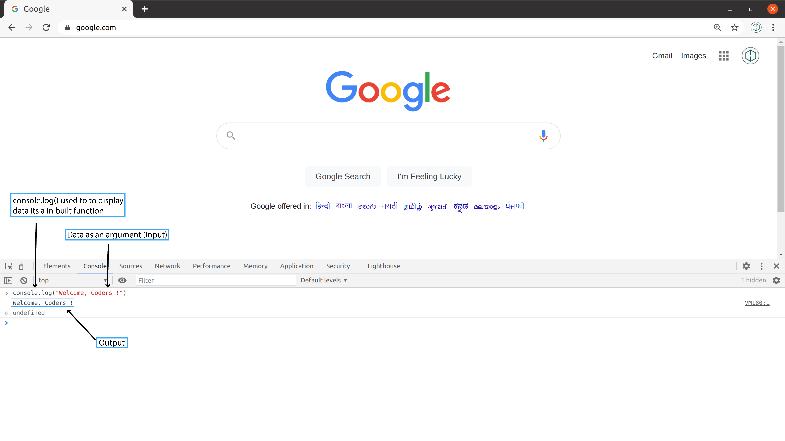

#### Writing Code on Browser Console

We can write any JavaScript code on the Google console or any browser console. However, for this challenge, we only focus on Google Chrome console. Open the console using:

##### Console.log

To write our first JavaScript code, we used a built-in function **console.log()**. We passed an argument as input data, and the function displays the output. We passed 'Hello, World' as input data or argument in the console.log() function.

```js
console.log('Hello, World!')
```
##### Console.log with Multiple Arguments

The **conole.log()** function can take multiple parameters separated by comma. The syntax looks like as follows:**console.log(param1, param2, param3)**

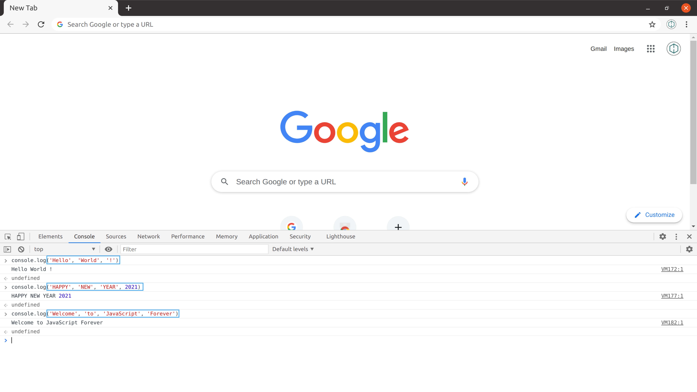

```js
console.log('Hello', 'World', '!')
console.log('HAPPY', 'NEW', 'YEAR', 2021)
console.log('Welcome', 'to', 'JavaScript', 'Forever')
```
As we can see from the snippet code written above, _console.log()_ can take multiple arguments.

Congratulations! You wrote your first JavaScript code using _console.log()_.

##### Comments

We can add comments to our code. As comments are very important to make code more readable and to leave remarks as well. In scripting languages it does not execute the comment part of our code. In JavaScript, any text line starting with **//** in JavaScript is a comment, and anything enclosed like this **/\* \*/** is also a comment.

**Example: Single Line Comment**

**//** This is the first comment  
**//** This is the second comment  
**//** I am a single line comment

**Example: Multiline Comment**

**/_**
This is a multiline comment  
 Multiline comments can take multiple lines  
 JavaScript is the language of the web  
 **_/**


##### Syntax

Programming languages are similar to human languages. English or many other language uses words, phrases, sentences, compound sentences and other more ways to convey a meaningful message. The English meaning of syntax is _the arrangement of words and phrases to create well-formed sentences in a language_. The technical definition of syntax is _the structure of statements in a computer language._ Programming languages have **syntax**. As JavaScript is a programming language it has its own syntax. If we do not write a syntax that JavaScript understands, it will raise different types of errors. There are dozen of different kinds of JavaScript errors later. For now, let us see syntax errors.

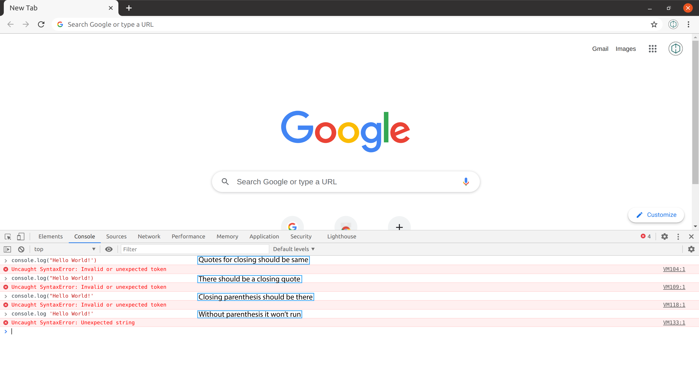

We get a response, In which console raises syntax errors. Actually, the syntax is very informative. It informs what type of mistake was made. By reading the error feedback guideline, we can correct the syntax and fix the problem. The process of identifying and removing errors from a program is called debugging. Let us fix the errors:

```js
console.log('Hello, World!')
console.log('Hello, World!')
```

So far, we saw how to display text using the _console.log()_. If we are printing text or string using _console.log()_, the text has to be inside the single quotes, double quotes, or a backtick quotes.
**Example:**

```js
console.log('Hello, World!')
console.log("Hello, World!")
console.log(`Hello, World!`)
```

#### Arithmetics

Now, let us practice more writing JavaScript codes using _console.log()_ on google chrome console for number data types.
In addition to the text, we can also do mathematical calculations using JavaScript. Let us do the following simple calculations.

The console can directly take arguments without the **_console.log()_** function. However, it is included in this introduction because most of this challenge would be taking place in a text editor where the usage of the function would be mandatory. You can play around directly with instructions on the console.
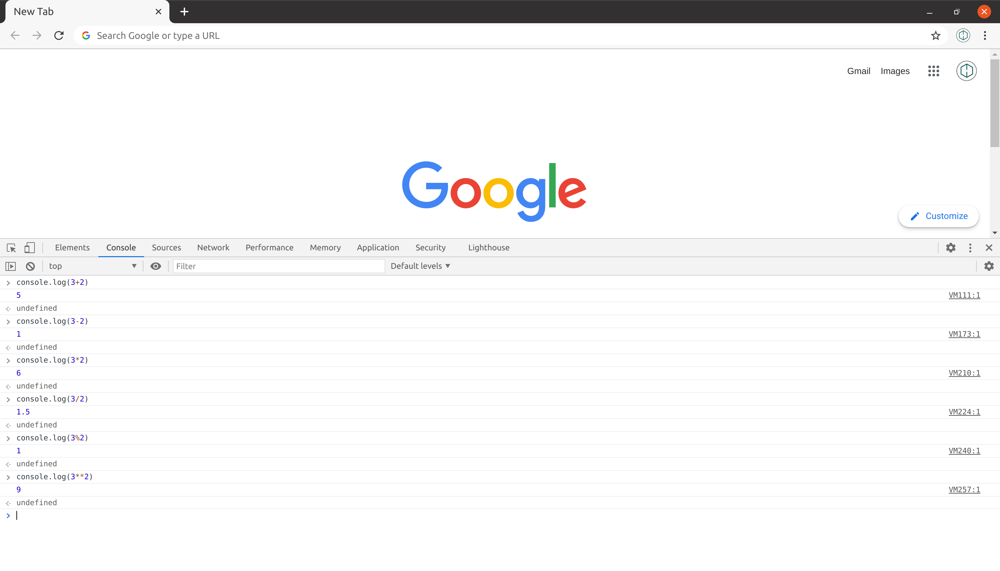

```js
console.log(3 + 2) // Addition
console.log(3 - 2) // Subtraction
console.log(3 * 2) // Multiplication
console.log(3 / 2) // Division
console.log(3 % 2) // Modulus - finding remainder
console.log(3 ** 2) // Exponentiation 3 ** 2 == 3 * 3
```
### Code Editor

We can write our codes on the browser console, but it won't do for bigger projects. In a real working environment, developers use different code editors to write their codes. Code editors immediately warn for any syntax errors. Developers don't have to worry about syntax. Auto indentation & auto-completion saves a lot of time. Some editors like sublime text and visual studio code have an integrated terminal, we will be using Visual Studio Code for this course.

#### Installing Visual Studio Code

Visual studio code is a very popular open-source text editor by Microsoft. [Download Visual Studio Code](https://code.visualstudio.com/), but if you are in favor of other editors, feel free to follow with what you have.

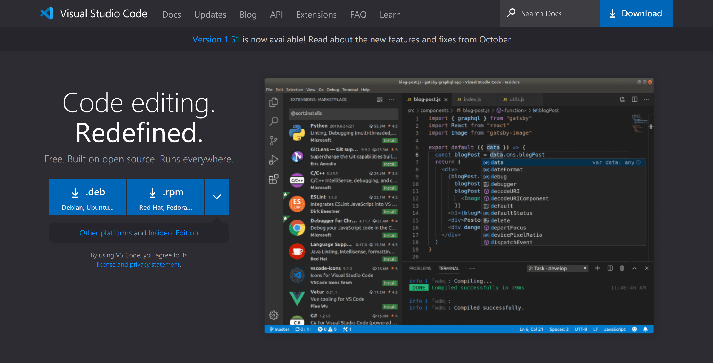


#### How to Use Visual Studio Code

Open the Visual Studio Code by double-clicking its icon. When you open it, you will get this kind of interface. Try to interact with the labeled icons.

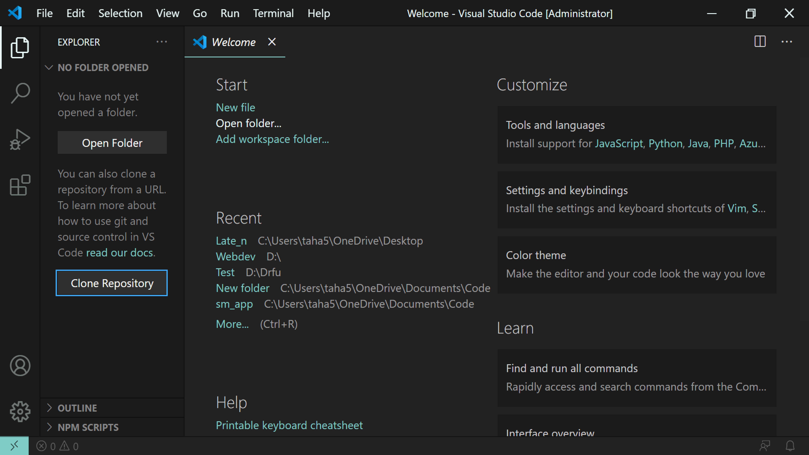

Clone the repo.

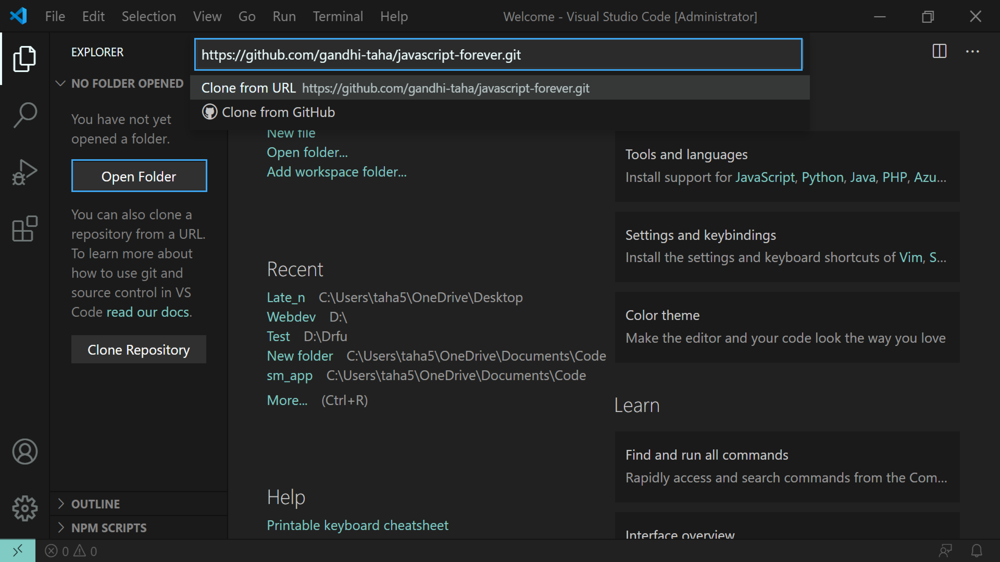

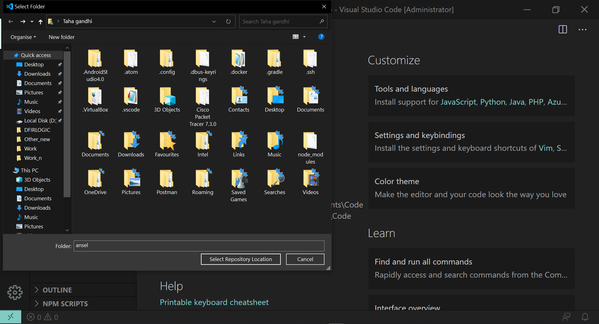

Vscode Interface and Component.

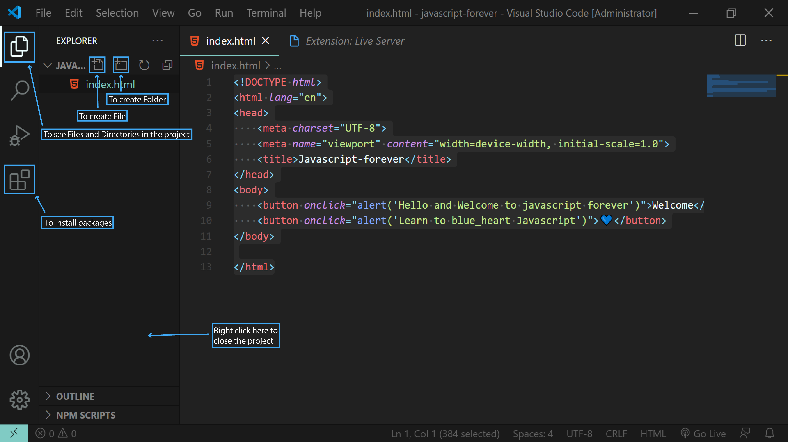

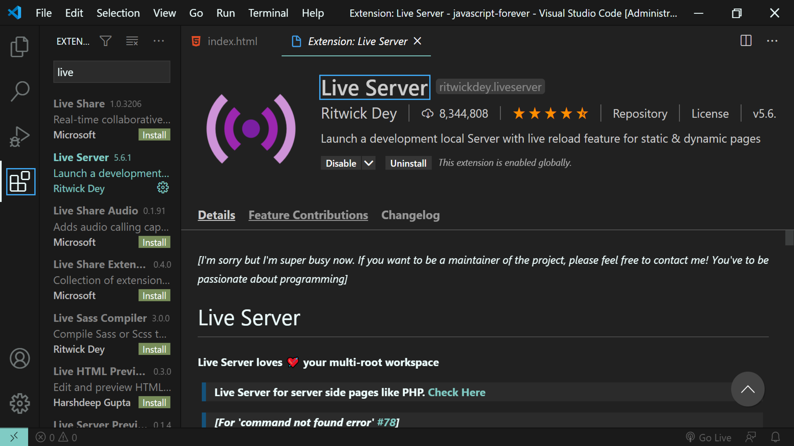

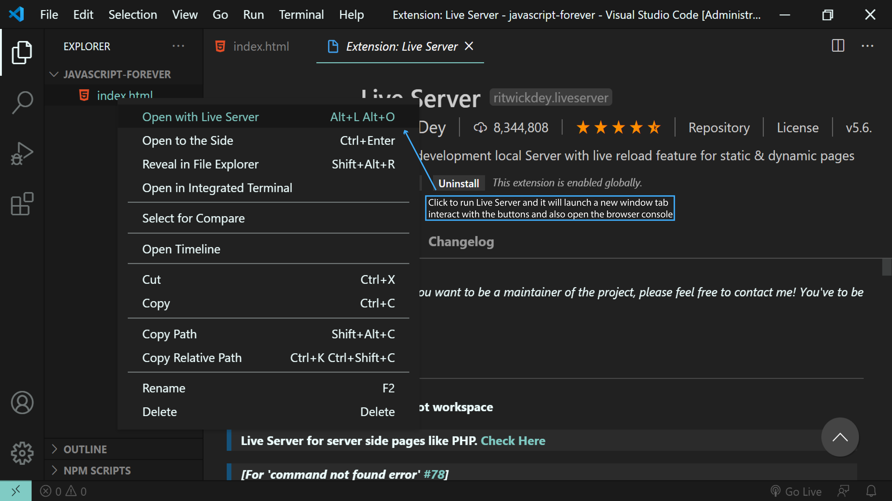

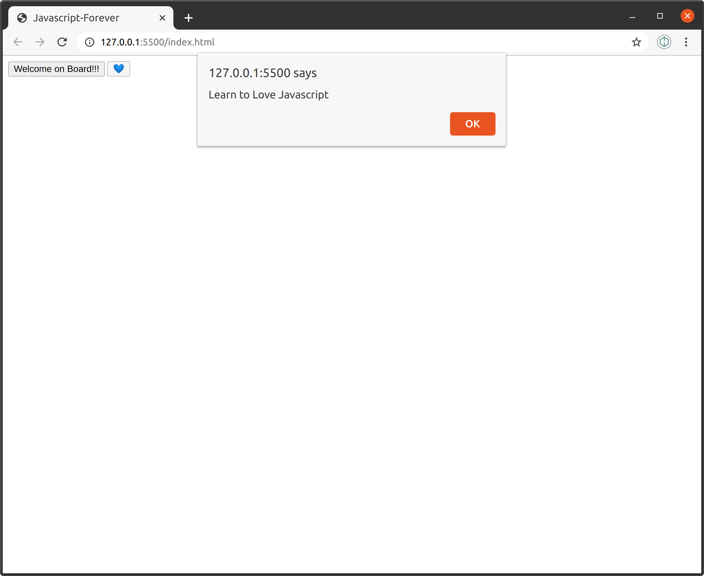

## Adding JavaScript to a Web Page

JavaScript can be added to a web page in three different ways:

- **_Inline script_**
- **_Internal script_**
- **_External script_**
- **_Multiple External scripts_**

The following sections show different ways of adding JavaScript code to your web page.

### Inline Script

Create a project folder on your desktop or in any location, name it Javascript-Forever and create an **_index.html_** file in the project folder. Then paste the following code and open it in a browser, for example [Chrome](https://www.google.com/chrome/).


```html
<!DOCTYPE html>
<html>
<head>
  <title>Javascript-Forever:Inline Script</title>
</head>
<body>
  <button onclick="alert('Welcome to Javascript-Forever')">
    Click Me
  </button>
</body>
</html>
```
Now, we have just wrote our first inline script. We can create a pop up alert message using the _alert()_ built-in function.

### Internal Script

The internal script can be written in the _head_ or the _body_, but it is preferred to put it on the body of the HTML document.
First, let us write on the head part of the page.

```html
<!DOCTYPE html>
<html>
  <head>
    <title>Javascript-Forever:Internal Script</title>
    <script>
      console.log('Welcome to Javascript-Forever')
    </script>
  </head>
  <body></body>
</html>
```
This is how we write an internal script in HTML Document. Writing the JavaScript code in the body section is the most preferred option. Open the browser console to view the output from the console.log()

```html
<!DOCTYPE html>
<html>
  <head>
    <title>Javascript-Forever:Internal Script</title>
  </head>
  <body>
    <button onclick="alert('Welcome to Javascript-Forever');">Click Me</button>
    <script>
      console.log('Welcome to Javascript-Forever')
    </script>
  </body>
</html>
```

Open the browser console to see the output from the console.log()

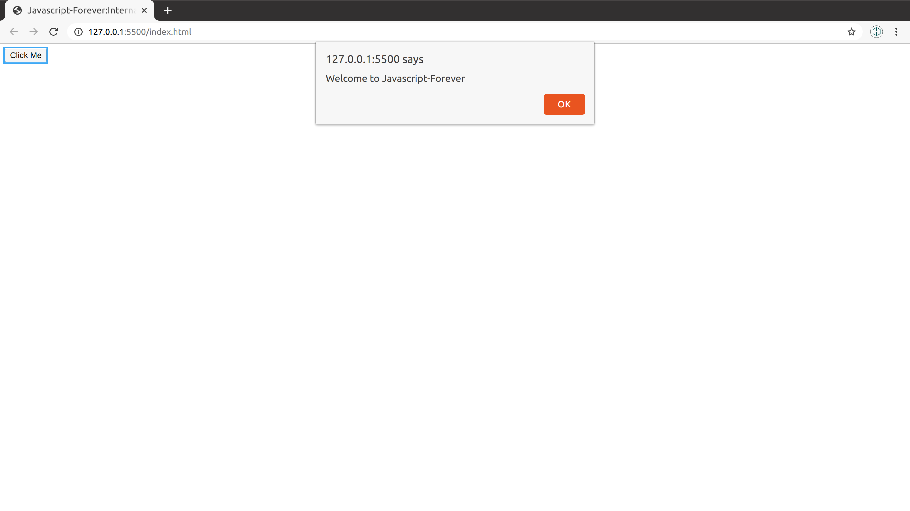

### External Script

Similar to the internal script, the external js script can link to header or body, but it is preferred to put it in the body.
First, we should create an external JavaScript file it has .js extension. Create a file named index.js inside your project directory and write the following code and link that in the bottom of body tag.

```js
console.log('Welcome to Javascript-Forever')
```

External scripts in the _head_:

```html
<!DOCTYPE html>
<html>
  <head>
    <title>Javascript-Forever:External script</title>
    <script src="index.js"></script>
  </head>
  <body></body>
</html>
```
External scripts in the _body_:

```html
<!DOCTYPE html>
<html>
  <head>
    <title>Javascript-Forever:External script</title>
  </head>
  <body>
    // We can add it in the header or in the body 
    // But this is recommended place to put the script
    <script src="index.js"></script>
  </body>
</html>
```

Open the browser console to see the output of the console.log()

### Multiple External Scripts

We can also link multiple external JavaScript files to a web page.
Create a helloworld.js file inside the Javascript-Forever folder and write the following code.

```js
console.log('Hello, World!')
```

```html
<!DOCTYPE html>
<html>
  <head>
    <title>Multiple External Scripts</title>
  </head>
  <body>
    <script src="./helloworld.js"></script>
    <script src="./index.js"></script>
  </body>
</html>
```

_Your main.js file should be below all other scripts_. It is very important to remember this.

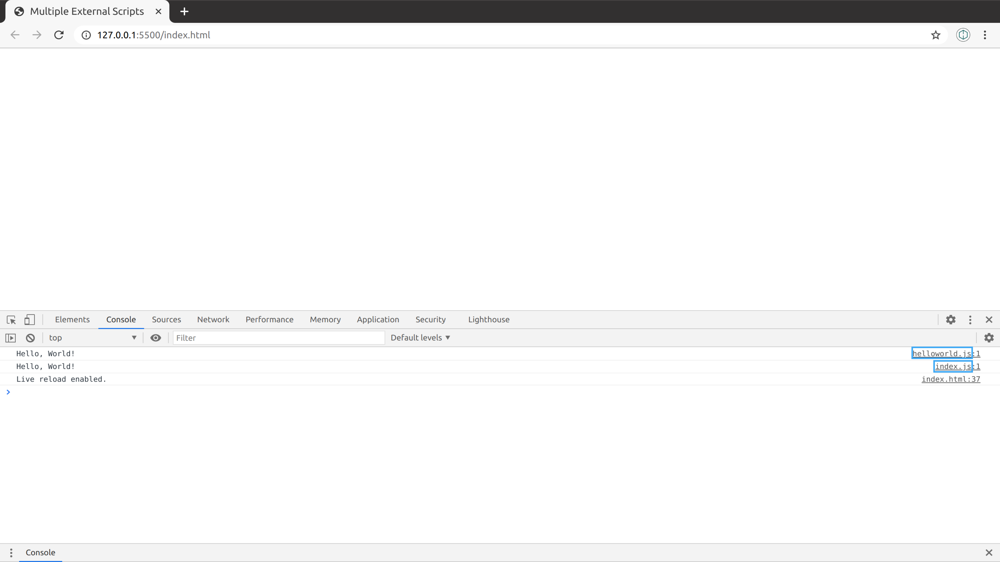

In JavaScript and in also other programming languages, there are different kinds of data types. The following are JavaScript primitive data types:_String, Number, Boolean, undefined, Null_, and _Symbol_.

### Numbers

- Integers: Integer (negative, zero and positive) numbers
  Example:
  ... -3, -2, -1, 0, 1, 2, 3 ...
- Float-point numbers: Decimal number
  Example
  ... -3.5, -2.25, -1.0, 0.0, 1.1, 2.2, 3.5 ...

### Strings

A collection of one or more characters between two single quotes, double quotes, or backticks.
**Example:**

```js
'Taha Gandhi'
'India 🇮🇳️'
'JavaScript is a beautiful programming language'
'I love teaching 💙️'
'I hope you are enjoying the first Module'
`We can also create a string using a backtick`;
('A string could be just as small as one character as big as many pages')
```

### Booleans

A boolean value is either yes or no. Any comparisons return a boolean value, which is either true or false.

A boolean data type is either a true is **1** or false value while be **0**.

**Example:**

```js
true // if the light on ,the value is true
false // if the light off, the value is false
```

### Undefined

In JavaScript, if we don't assign a value to a variable, the value is undefined. In addition to that, if a function is not returning anything, it returns undefined.

```js
let firstName
console.log(firstName) //not defined, because it is not assigned to a value yet
```

### Null

Null in JavaScript means an empty value.

```js
let emptyValue = null
```

## Checking Data Types

To check the data type of a certain variable, we use the **typeof** operator. See the following example.

```js
console.log(typeof 'Javascrip-Forever') // string
console.log(typeof 5) // number
console.log(typeof true) // boolean
console.log(typeof null) // object type
console.log(typeof undefined) // undefined
```

## Comments Again

Remember that commenting in JavaScript is similar to other programming languages. Comments are important in making your code more readable.
There are two ways of commenting:

- _Single line commenting_
- _Multiline commenting_

```js
// commenting the code itself with a single comment
// let firstName = 'Taha'; single line comment
// let lastName = 'Gandhi'; single line comment
```

```js
/*
    let location = 'India';
    let age = 100;
    let isDev = true;
    This is a Multiple line comment
    */
```

## Variables

Variables are _containers_ of data. Variables are used to _store_ data in a memory location. When a variable is declared, a memory location is reserved. When a variable is assigned to a value (data), the memory space will be filled with that data. To declare a variable, we use _var_, _let_, or _const_ keywords.

For a variable that changes at a different time, we use _let_. If the data does not change at all, we use _const_. For example, PI, country name, gravity do no change, and we can use _const_. We will not use var in this challenge and I don't recommend you to use it. It is error prone way of declaring variable it has lots of leak. We will talk more about var, let, and const in detail in other sections (scope). For now, the above explanation is enough.


A valid JavaScript variable name must follow the following rules:

- A JavaScript variable name should not begin with a number.
- A JavaScript variable name does not allow special characters except dollar sign and underscore.
- A JavaScript variable name follows a camelCase convention.
- A JavaScript variable name should not have space between words.

The following are examples of valid JavaScript variables.

```js
firstName
lastName
country
city
capitalCity
age
isDev

first_name
last_name
is_dev
capital_city

num1
num_1
_num_1
$num1
year2021
year_2022
```

The first and second variables on the list follows the camelCase convention of declaring in JavaScrip. In this material, we will use camelCase variables.

Example of invalid variables:

```sh
  first-name
  1_no
  no_#_1
```

Let us declare variables with different data types. To declare a variable, we need to use *let* or *const* keyword before the variable name. Following the variable name, we write an equal sign (assignment operator), and a value(assigned data).

```js
// Syntax
let nameOfVariable = value
```

**Examples of declared variables**

```js
// Declaring different variables of different data types
let firstName = 'Taha'; // first name of a person
let lastName = 'Gandhi'; // last name of a person
let country = 'India'; // country
let age = 100; // age in years
let isDev = true;

console.log(firstName, lastName, country, age, isDev);
```
```sh
Taha Gandhi India 100 True
```

```js
// Declaring variables with number values
let age = 100 // age in years
const gravity = 9.81 // earth gravity  in m/s2
const boilingPoint = 100 // water boiling point, temperature in C
const PI = 3.14 // geometrical constant

console.log(gravity, boilingPoint, PI)
```

```sh
9.81 100 3.14
```

```js
// Variables can also be declaring in one line separated by comma
let name = 'Taha Gandhi', // name of a person
  job = 'Dev',
  live = 'India';
console.log(name, job, live)
```

```sh
Taha Gandhi Dev India
```
When you run _index.html_ file in the 01-Module folder you should get this:

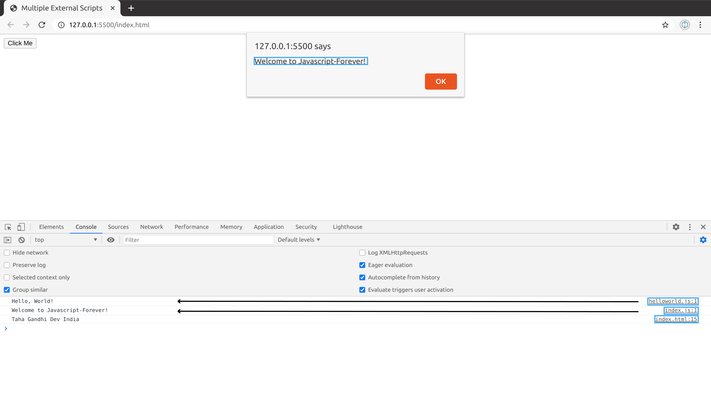

So you are amazing! You have just completed Module 01 challenge and you are on your way to greatness. Now do some exercises for your brain muscle.

## Practice

1. Write a single line comment which says, _comments can make code readable_
2. Write another single comment which says, _Welcome to Javascript-Forever_
3. Write a multiline comment which says, _comments can make code readable, easy to reuse_
   _and informative_

4. Create a variable.js file and declare variables and assign string, boolean, undefined and null data types
5. Create datatypes.js file and use the JavaScript **_typeof_** operator to check different data types. Check the data type of each variable
6. Declare four variables without assigning values
7. Declare four variables with assigned values
8. Declare variables to store your first name, last name, marital status, country and age in multiple lines
9. Declare variables to store your first name, last name, marital status, country and age in a single line
10. Declare two variables _myAge_ and _yourAge_ and assign them initial values and log to the browser console.

```sh
I am 100 years old.
You are 50 years old.
```

**Click below for second module.**
<br>
[Module 02 >>](Module_02/02_module_Data_types.md)